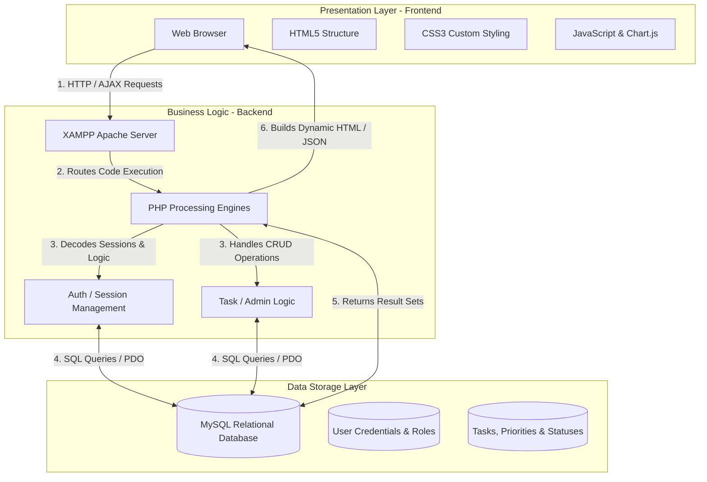

# 📊 Perform-X
> **A Modern Task and Performance Management System**
>
> Perform-X is a web-based, full-stack productivity platform designed to streamline task organization, monitoring, and team performance tracking. Built to empower teams with structured workflows, dynamic insights, and responsive designs, Perform-X acts as the ultimate centralized workspace for execution and performance evaluation.
---
## 🚀 Key Highlights & Badges
[](https://developer.mozilla.org/en-US/docs/Web/HTML)
[](https://developer.mozilla.org/en-US/docs/Web/CSS)
[](https://developer.mozilla.org/en-US/docs/Web/JavaScript)
[](https://www.php.net/)
[](https://www.mysql.com/)
[](https://www.apachefriends.org/)
[](https://git-scm.com/)
---
## 📌 Table of Contents
- [Overview](#-overview)
- [Features](#%EF%B8%8F-features)
- [Technology Stack](#-technology-stack)
- [System Architecture](#%EF%B8%8F-system-architecture)
- [Installation](#%EF%B8%8F-installation)
- [Usage](#-usage)
- [Project Structure](#%EF%B8%8F-project-structure)
- [Future Improvements](#-future-improvements)
- [Challenges Solved](#-challenges-solved)
- [Skills Demonstrated](#-skills-demonstrated)
- [Screenshots](#-screenshots)
- [Author](#-author)
---
## 🔍 Overview
**Perform-X** is developed to bridge the gap between individual task execution and macro team performance metrics. Traditional task managers often lack integrated, direct performance analytics that connect a user's daily habits to team success rates. 
By combining a sleek, professional SaaS dashboard user interface with a robust, session-backed PHP/MySQL backend, Perform-X enables managers to assign work, set granular priorities, monitor ongoing completion rates, and dynamically review metrics like *Task Completion Velocity* and *Average Focus Time*—all from a single responsive application.
---

## 🕹️ Features

Perform-X comes equipped with a comprehensive set of features tailored for modern collaborative work:
|
 Feature 
|
 Description 
|
|
:---
|
:---
|
|
**
🔒 User Authentication
**
|
 Secure, session-based login and registration system with role-based dashboard redirection for Admins and regular users. 
|
|
**
📋 Task Assignment
**
|
 Easily create tasks, assign specific teammates, and set strict time windows for execution. 
|
|
**
⚡ Task Priority Management
**
|
 Support for 
**
High
**
, 
**
Medium
**
, and 
**
Low
**
 priority tiers with distinct visual status alerts to emphasize critical actions. 
|
|
**
📈 Dashboard Analytics
**
|
 Visual charts (Weekly Task Velocity, Monthly Throughput) and numeric KPIs displaying success rates, completed goals, and focus durations. 
|
|
**
🔄 Progress Tracking
**
|
 Real-time progress bars indicating individual completion status relative to weekly and monthly targets. 
|
|
**
🔔 Notification System
**
|
 Dynamic UI indicators showing system activities, task assignments, and recent actions in the user workspace. 
|
|
**
🔍 Search & Filtering
**
|
 Comprehensive search bars with instant category-based filters (e.g., Design, Management, DevOps, Product, Operations). 
|
|
**
📱 Responsive Design
**
|
 Optimized viewport responsiveness featuring a collapsible mobile drawer menu ensuring a fluid experience across mobile, tablet, and desktop screens. 
|
|
**
🌓 Dark & Light Mode
**
|
 Persisted color theme configurations for reduced eye strain and high readability under varying lighting conditions. 
|
|
**
🎯 Task Completion Tracking
**
|
 Quick-action inline table buttons allowing users to check off, edit, or delete items seamlessly. 
|
---
## 🛠️ Technology Stack
Perform-X uses a solid full-stack structure utilizing proven, high-performance web development technologies:
### **Frontend (Client Side)**
*   **HTML5:** Structured semantic markup utilizing HTML5 standards for maximum accessibility and SEO excellence.
*   **CSS3:** Custom responsive stylesheets containing modular layouts (Flexbox, CSS Grid), CSS variables for theming, smooth transitions, and premium micro-animations.
*   **JavaScript (ES6+):** Vanilla client-side script driving the UI interactions, dynamic dropdown toggles, and Chart.js integration for beautiful rendering of performance graphs.
### **Backend (Server Side)**
*   **PHP:** Structured, secure server-side logic responsible for handling session states, sanitizing inputs, processing form actions, and API request routing.
### **Database**
*   **MySQL:** High-performance relational database containing optimized schemas for users, tasks, logs, and relationships.
### **Tools & Environment**
*   **XAMPP:** Local server stack (Apache & MySQL) utilized for hosting and testing the platform locally.
*   **Git & GitHub:** Version control and remote repository management for clean, collaborative codebase progression.
---
## 🏗️ System Architecture
Perform-X follows a traditional **Client-Server-Database (3-Tier)** architecture pattern. This separation of concerns ensures that the presentation layer is decoupled from the business logic and database queries.

### **Interaction Workflow:**
1.  **Frontend (Client):** The user interacts with the UI (e.g., clicks "Add Task" or filters categories). JavaScript intercepts UI interactions and triggers standard browser form actions or background API requests.
2.  **Backend (Server):** The XAMPP Apache server receives the requests and hands them off to the **PHP** parser. PHP verifies whether the user is securely logged in using active `$_SESSION` structures.
3.  **Database (Data):** If authorized, PHP executes query sequences on the **MySQL** database (creating, updating, reading, or deleting records).
4.  **Response:** The retrieved records are returned to PHP, which formats the information into dynamic views and transfers them back to the user's browser, instantly updating their dashboard.
---
## ⚙️ Installation
To host and run **Perform-X** locally on your system, please execute the following detailed steps:
> [!IMPORTANT]
> Ensure you have **XAMPP** (or a local stack featuring Apache PHP 7.4+ and MySQL 5.7+) pre-installed on your computer.
### **Step 1: Clone the Repository**
Open your terminal (Git Bash, Command Prompt, or PowerShell) and clone the repository:
```bash
git clone https://github.com/your-username/Perform-X.git
```
### **Step 2: Move Project to XAMPP htdocs**
Copy or move the cloned `Perform-X` directory to your local XAMPP installation directory's server root:
*   **Windows:** `C:\xampp\htdocs\Perform-X`
*   **macOS:** `/Applications/XAMPP/xamppfiles/htdocs/Perform-X`
### **Step 3: Start Apache and MySQL**
1.  Launch the **XAMPP Control Panel**.
2.  Click **Start** next to **Apache** and **MySQL**.
3.  Ensure both services are running and their indicators show active green statuses.
### **Step 4: Import the Database**
1.  Open your web browser and navigate to: `http://localhost/phpmyadmin/`
2.  Click **New** on the left sidebar to create a database.
3.  Name the database `perform_x_db` and click **Create**.
4.  Select the newly created database, go to the **Import** tab at the top.
5.  Click **Choose File**, select the SQL database backup file (e.g., `database/schema.sql` located inside your project folder), and click **Go** or **Import**.
### **Step 5: Configure the Database Connection**
Verify your database connection settings in the system's configuration file (e.g., `config/db.php` or where the PDO connection is initialized):
```php
<?php
$host = "localhost";
$db_name = "perform_x_db";
$username = "root";
$password = ""; // Default XAMPP MySQL password is empty
try {
    $conn = new PDO("mysql:host=" . $host . ";dbname=" . $db_name, $username, $password);
    $conn->setAttribute(PDO::ATTR_ERRMODE, PDO::ERRMODE_EXCEPTION);
} catch(PDOException $e) {
    echo "Connection error: " . $e->getMessage();
}
?>
```
### **Step 6: Run the Project**
Navigate to the following address in your browser's address bar to access the platform:
```text
http://localhost/Perform-X/index.html
```
---
## 🎯 Usage
Once the platform is running, users can interact with the system via these clear journeys:
### **1️⃣ Register & Login**
*   **Sign Up:** First-time users navigate to the registration screen, enter their credentials, choose a user role, and set up their profile.
*   **Sign In:** Users are authenticated through secure password hashing and dynamically redirected to either the **Admin Portal** or the main **User Dashboard** depending on their roles.
### **2️⃣ Create & Assign Tasks**
*   Managers click **Add Task** to open the task creation form.
*   They specify the title, select a category (e.g., DevOps), assign a team member, set a time window, and define the priority level.
### **3️⃣ Set Priorities & Manage Statuses**
*   Tasks are created with a state of `Pending`.
*   As developers work on their items, they can update task states between `In Progress`, `Completed`, or `Delayed`. Priority labels highlight critical tasks requiring immediate attention.
### **4️⃣ Monitor Performance Analytics**
*   Users review the **Analytics Dashboard** to see live indicators of their daily completion velocity.
*   Managers check team performance metrics, average focus rates, and task completion percentages to identify potential bottlenecks.
### **5️⃣ Receive System Notifications & Work Updates**
*   The "Recent Activity" and top-bar notification panels highlight recent team edits, new task allocations, and automated system reports in real-time.
---
## 📁 Project Structure
Here is a high-level representation of how the project files are organized:
```text
Perform-X/
│
├── admin/                  # Administrative Portal
│   ├── index.html          # Admin Panel central dashboard
│   ├── compliance.html     # Auditing, reporting, and policy storage
│   ├── logs.html           # System operations and error logs
│   └── settings.html       # Admin system configuration settings
│
├── assets/                 # System Static Assets
│   ├── css/                # Global and component-specific stylesheets
│   │   ├── style.css       # Core layout framework & global variables
│   │   └── task.css        # Custom table, grid layouts, and cards
│   ├── js/                 # Client-side dynamic interaction scripts
│   │   ├── main.js         # Core ChartJS configuration and calculations
│   │   └── ui.js           # Shared dynamic interface mechanics
│   └── images/             # Profile pictures, logos, and UI backgrounds
│
├── auth/                   # Authentication Pages
│   ├── login.html          # User login interface
│   └── register.html       # User signup / registration interface
│
├── components/             # Reusable UI Markup Blocks
│   ├── navbar.html         # Shared header navbar
│   └── sidebar.html        # Shared navigation sidebar
│
├── database/               # Database Scripts
│   └── schema.sql          # Primary MySQL table creation script
│
├── pages/                  # Main User Interface Pages
│   ├── task.html           # Task Manager core view
│   ├── report.html         # Performance reports & analytical overview
│   └── team.html           # Team member management list
│
├── index.html              # Main User Dashboard entry landing point
└── README.md               # Dynamic system documentation
```
---
## 🔮 Future Improvements
While Perform-X is currently full-featured, we plan to implement several upgrades:
*   **💬 Real-Time Notifications:** Integrate WebSockets (or server-sent events) to push task updates to team members instantly without requiring manual page refreshes.
*   **🛡️ Smart Task Conflict Handling:** Add an intelligent algorithm to detect overlapping schedules and issue warnings when a developer is assigned multiple high-priority tasks in the same time window.
*   **📊 Advanced Analytics:** Integrate machine learning APIs to predict task completion timelines based on historical velocity and individual team member workload.
*   **📱 Native Mobile Optimization:** Develop a specialized mobile layout utilizing progressive web app (PWA) guidelines to support push notifications and offline mode operations.
---
## 🧠 Challenges Solved
During the engineering lifecycle of Perform-X, several technical difficulties were overcome:
1.  **Ensuring Seamless Database State Management:**
    *   *Challenge:* When managing task allocations across multiple teams, conflicting database locks and concurrency spikes caused session values to desynchronize occasionally.
    *   *Solution:* We leveraged structured transactional PDO procedures in PHP and set up indexing protocols on critical fields in the MySQL database to guarantee data isolation and reliability.
2.  **Maintaining Layout Uniformity Across Devices:**
    *   *Challenge:* Traditional data tables with several columns (Task Title, ID, Priority, Status, Actions, Time Window) easily break layout grids when rendered on compact mobile devices.
    *   *Solution:* We implemented adaptive CSS Grid patterns and media query directives to systematically collapse columns into expandable detail cards on smaller screen viewports, keeping all key metrics accessible.
3.  **Dynamic Rendering of Analytical Visuals:**
    *   *Challenge:* Correlating real-time database updates to Chart.js charts without introducing performance delays.
    *   *Solution:* We optimized JSON payload structures sent from PHP and set up responsive callback functions in JavaScript to refresh canvas data dynamically without full-page reloads.
---
## 🎓 Skills Demonstrated
*   **💻 Full Stack Development:** Bridging highly-interactive client-side pages with reliable, secure, session-driven backend scripts.
*   **🗄️ Database Design:** Architecting relational tables with optimal constraints, logical primary-foreign key relationships, and optimized query paths.
*   **🎨 UI/UX Design:** Implementing modern SaaS visual aesthetics, using harmonized color palettes (HSL), clear typography, consistent components, and engaging micro-animations.
*   **🐛 Debugging & Optimization:** Troubleshooting server exceptions, database locks, and DOM elements using advanced debugging tools.
*   **📐 Software Engineering Principles:** Utilizing standard architecture patterns, separation of concerns (MVC concept), robust error boundary setups, and clean, self-documenting code.
---
## 📸 Screenshots
Here is a visual showcase of the platform interfaces:
### **1. Performance Dashboard (Overview)**
*Place visual screenshot of Dashboard index.html here*
```text
┌───────────────────────────────────────────────────────────┐
│ [Perform-X]  🔍 Search...                      Alex [👤] │
├───────────────────────────────────────────────────────────┤
│ 📊 Dashboard  Performance Dashboard                       │
│ 📋 Tasks      Today's Tasks: [ 12 ]    Completed: [ 8 ]    │
│ 📈 Reports    Success %: [ 94.2% ]     Perf Score: [ 88 ]  │
│ 👥 Team                                                   │
│               [ Weekly Task Velocity ]  [Monthly Volume]  │
│               (Line Chart showing task  (Bar chart showing│
│                completion speed)        throughput)       │
└───────────────────────────────────────────────────────────┘
```
### **2. Task Manager (Board View)**
*Place visual screenshot of Task Board pages/task.html here*
```text
┌───────────────────────────────────────────────────────────┐
│ [Perform-X]  🔍 Search...                      Alex [👤] │
├───────────────────────────────────────────────────────────┤
│ 📊 Dashboard  Task Manager                                │
│ 📋 Tasks      [All Categories ▾]  [Today, Oct 24]  [+ Add]│
│ 📈 Reports    ------------------------------------------  │
│ 👥 Team       Title              Priority  Status  Time   │
│               Quarterly Review   [High]   [▶ In P]  09:00 │
│               Team KPI Sync      [Medium] [✔ Done]  12:00 │
└───────────────────────────────────────────────────────────┘
```
---
## 👤 Author
**Abenezer**  
🎓 *Software Engineering Student*  
*Passionate about building responsive full-stack applications, modern UI/UX design architectures, and scalable web solutions.*
*   **GitHub:** [@your-github-username](https://github.com/)
*   **LinkedIn:** [Your LinkedIn Profile](https://linkedin.com/)
*   **Email:** [your-email@student.domain](mailto:your-email@student.domain)
---
*Thank you for exploring Perform-X! If you find this project helpful, please consider giving it a ⭐ on GitHub!*
